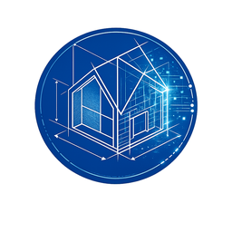
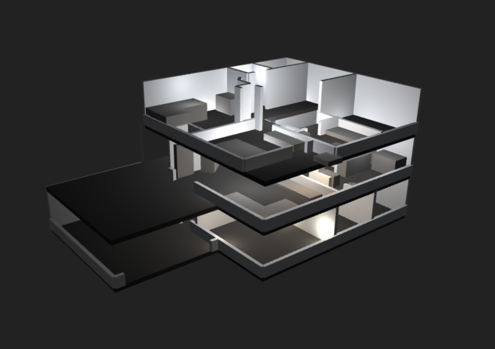

# MimeSys - 3D Home Digital Twin for Home Assistant

Create a stunning 3D visualization of your home that syncs in real-time with your Home Assistant lights. Design your home layout, place lights with the exact entity IDs from Home Assistant, and watch them sync automatically!


## Screenshot



---

## Quick Start for Home Assistant Users

This guide will help you set up MimeSys in Home Assistant from start to finish:

1. **Install the MimeSys Addon** - The 3D editor and API
2. **Install the MimeSys Sync Integration** - Real-time light synchronization
3. **Create your 3D home** - Design your layout
4. **Name your lights correctly** - Use exact entity IDs
5. **Enjoy real-time sync!** - Lights update automatically

---

## Table of Contents

- [Installation](#installation)
  - [Step 1: Install MimeSys Addon via HACS](#step-1-install-mimesys-addon-via-hacs)
  - [Step 2: Install MimeSys Sync Integration via HACS](#step-2-install-mimesys-sync-integration-via-hacs)
- [Creating Your 3D Home](#creating-your-3d-home)
  - [Accessing the Editor](#accessing-the-editor)
  - [Building Your Home](#building-your-home)
  - [Adding Lights with Correct Names](#adding-lights-with-correct-names)
  - [Saving Your Design](#saving-your-design)
- [Setting Up Light Synchronization](#setting-up-light-synchronization)
- [Viewing Your Home](#viewing-your-home)
- [Troubleshooting](#troubleshooting)
- [Advanced Features](#advanced-features)

---

## Installation

### Step 1: Install MimeSys Addon via HACS

The MimeSys addon provides the 3D editor and API server.

#### 1.1 Add the Repository to HACS

1. Open Home Assistant
2. Navigate to **HACS** (install HACS first if you haven't: https://hacs.xyz/docs/setup/download)
3. Click on **Settings** (bottom right)
4. Under **Custom repositories**, add:
   - **Repository**: `https://github.com/oliverruoff/MimeSys`
   - **Category**: Select **Integration**
5. Click **Add**
6. Close the settings

#### 1.2 Install the Addon

1. Go to **Settings** → **Add-ons** → **Add-on Store**
2. Click the **⋮** menu (three dots) in the top right
3. Select **Repositories**
4. Add: `https://github.com/oliverruoff/MimeSys`
5. Click **Add**
6. Refresh the page
7. Find **"3D Home Digital Twin"** in the list
8. Click it and then click **Install**
9. Wait for installation to complete

#### 1.3 Start the Addon

1. After installation, go to the **Info** tab
2. Click **Start**
3. Enable **Start on boot** (recommended)
4. Enable **Watchdog** (recommended for auto-restart on failure)
5. Wait for the addon to start (green indicator)

#### 1.4 Verify Installation

1. Click **Open Web UI** in the addon page
2. You should see the MimeSys 3D editor
3. The API is now available at `http://localhost:8000`

---

### Step 2: Install MimeSys Sync Integration via HACS

The integration syncs your Home Assistant lights with the 3D model in real-time.

#### 2.1 Add the Integration Repository

1. Open **HACS** → **Integrations**
2. Click the **⋮** menu (three dots) in the top right
3. Select **Custom repositories**
4. Add:
   - **Repository**: `https://github.com/oliverruoff/MimeSys`
   - **Category**: **Integration**
5. Click **Add**

#### 2.2 Install the Integration

1. Click **Explore & Download Repositories**
2. Search for **"MimeSys Digital Twin Sync"**
3. Click on it
4. Click **Download**
5. Select the latest version
6. Click **Download**
7. **Restart Home Assistant** (required!)

#### 2.3 Configure the Integration

1. After restart, go to **Settings** → **Devices & Services**
2. Click **+ Add Integration**
3. Search for **"MimeSys"**
4. Click **MimeSys Digital Twin Sync**
5. Configure:
   - **API URL**: `http://localhost:8000` (default, leave as-is if addon is running locally)
   - **Entities**: Select the light entities you want to sync
     - Use the entity selector to pick lights from your Home Assistant
     - You can select multiple lights
6. Click **Submit**
7. The integration will immediately sync all selected lights to MimeSys!

---

## Creating Your 3D Home

### Accessing the Editor

1. Go to **Settings** → **Add-ons** → **3D Home Digital Twin**
2. Click **Open Web UI**
3. Or access directly: `http://homeassistant.local:8000`

### Building Your Home

#### Step 1: Draw Your Floor Plan

1. Click **"Add Ground"** in the toolbar
2. Click points to outline your room/floor shape
3. Click near the starting point to close the shape
4. Press **Enter** to finish
5. The floor will appear in 3D

#### Step 2: Add Walls

1. Click **"Add Wall"**
2. Click two points to place a wall
3. The wall appears with measurement displayed
4. Repeat for all walls
5. Press **Escape** to stop adding walls

#### Step 3: Add Objects (Optional)

1. Click **"Add Cube"** to place furniture/objects
2. Click where you want to place it
3. Use the left sidebar to customize:
   - Name, size, position, rotation, color
4. Great for representing furniture, appliances, etc.

### Adding Lights with Correct Names

**This is the most important step for synchronization!**

#### Understanding Light Names

For lights to sync with Home Assistant, the light name in MimeSys **MUST EXACTLY MATCH** the Home Assistant entity ID.

#### Example Mapping

| Home Assistant Entity ID | MimeSys Light Name | Will Sync? |
|--------------------------|-------------------|------------|
| `light.living_room_ceiling` | `light.living_room_ceiling` | ✅ YES |
| `light.kitchen_spots` | `light.kitchen_spots` | ✅ YES |
| `light.bedroom_lamp` | `Bedroom Lamp` | ❌ NO - doesn't match! |
| `light.hallway` | `light.hallway` | ✅ YES |

#### How to Add Lights Correctly

1. **Find Your Entity IDs First**:
   - Go to **Settings** → **Devices & Services** → **Entities**
   - Find your light entities (they start with `light.`)
   - Copy the entity ID (e.g., `light.living_room_ceiling`)

2. **Add Light in MimeSys**:
   - Click **"Add Light"** in the toolbar
   - Click where you want the light in the 3D view
   - The light appears on your floor

3. **Name the Light Correctly**:
   - Look at the **right sidebar** (Lights panel)
   - Find your newly added light
   - In the **Name** field, enter the EXACT entity ID
   - Example: `light.living_room_ceiling`
   - **Important**: Include the `light.` prefix!

4. **Adjust Light Properties** (Optional):
   - **Position**: Use X, Z sliders and height slider to position
   - **Brightness**: Set default brightness (will be overridden by HA)
   - **Color**: Set default color (will be overridden by HA)
   - **Toggle**: Turn on/off (will be overridden by HA)

#### Real-World Examples

**Example 1: Living Room**
```
Home Assistant: light.living_room_main
MimeSys Name:   light.living_room_main  ← Exact match!
```

**Example 2: Kitchen Spots**
```
Home Assistant: light.kitchen_led_spots
MimeSys Name:   light.kitchen_led_spots  ← Exact match!
```

**Example 3: Bedroom**
```
Home Assistant: light.bedroom_nightstand_left
MimeSys Name:   light.bedroom_nightstand_left  ← Exact match!
```

**Example 4: Multi-Floor Setup**
```
Home Assistant:
  - light.eg_flur_licht           (Ground floor hallway)
  - light.og_schlafzimmer_decke   (First floor bedroom ceiling)
  - light.dg_buero_schreibtisch   (Second floor office desk)

MimeSys Names (on respective floors):
  - light.eg_flur_licht           ← Floor 0 (Ground)
  - light.og_schlafzimmer_decke   ← Floor 1 (First)
  - light.dg_buero_schreibtisch   ← Floor 2 (Second)
```

#### Multiple Floors

1. Use the **Floor Navigation** (bottom left):
   - **Floor +**: Add a new floor
   - **▲ / ▼**: Switch between floors
2. Add lights on each floor
3. Name them with their entity IDs
4. Each floor syncs independently

### Saving Your Design

1. Click **"Save"** (top left)
2. Enter a filename (e.g., "my-home")
3. Click OK
4. Your design is saved to `/data/saves/my-home.json`

**Auto-saves are not enabled**, so remember to save regularly!

---

## Setting Up Light Synchronization

Once you've created your 3D home and named lights correctly:

### Configure the Integration (if not already done)

1. Go to **Settings** → **Devices & Services**
2. Find **"MimeSys Digital Twin Sync"**
3. Click **Configure**
4. Select the light entities you want to sync
5. These should match the lights you added in the 3D editor
6. Click **Submit**

### How Synchronization Works

1. **Real-Time Updates**: When you toggle a light in Home Assistant, it syncs to MimeSys within 1 second
2. **Brightness Sync**: Brightness changes sync automatically
3. **Color Sync**: RGB color changes sync automatically
4. **Initial Sync**: When you add entities or restart HA, all lights sync their current state immediately

### Verify Synchronization

1. Open the MimeSys showcase view: `http://homeassistant.local:8000/showcase`
2. In Home Assistant, toggle one of your synced lights
3. Watch the 3D model - the light should update immediately!
4. Check logs if it doesn't work (see Troubleshooting)

### Manual Testing

You can manually trigger a sync for debugging:

1. Go to **Developer Tools** → **Services**
2. Select service: `mimesys_sync.test_sync`
3. Enter your entity ID:
   ```yaml
   entity_id: light.living_room_ceiling
   ```
4. Click **Call Service**
5. Check **Settings** → **System** → **Logs** (search "mimesys")

---

## Viewing Your Home

MimeSys has two viewing modes:

### Editor Mode

Access: `http://homeassistant.local:8000`

- Full editing capabilities
- Navigate with mouse (rotate, pan, zoom)
- Edit lights, walls, objects
- Save/load designs
- Switch between floors

### Showcase Mode (Recommended for Dashboards)

Access: `http://homeassistant.local:8000/showcase`

- **Automatic camera rotation** around your home
- **Floor transitions**: Floors expand/collapse smoothly every 5 seconds
- **Real-time light sync**: See your HA lights update live!
- **No editing**: Perfect for displays
- **Infinite loop**: Cycles through all floors continuously

### Add to Home Assistant Dashboard

Create a beautiful 3D visualization on your dashboard:

```yaml
type: iframe
url: http://localhost:8000/showcase
aspect_ratio: 16:9
```

Or use the panel integration (if configured):

```yaml
type: custom:panel-iframe
url: http://localhost:8000/showcase
title: 3D Home
icon: mdi:home-floor-3
```

---

## Troubleshooting

### Lights Not Syncing

**Problem**: Toggling lights in HA doesn't update the 3D model

**Solutions**:

1. **Check Light Names**:
   - Open MimeSys editor
   - Look at the right sidebar (Lights panel)
   - Verify light names EXACTLY match entity IDs
   - Common mistake: `Bedroom Light` vs `light.bedroom_light`

2. **Check Integration Logs**:
   - Go to **Settings** → **System** → **Logs**
   - Search for "mimesys"
   - Look for these messages:
     ```
     🔔 Light state changed: light.living_room (OFF -> ON) - TRIGGERING SYNC
     📤 SENDING TO MIMESYS API: light.living_room
     ✅ SUCCESS! Updated 1 light(s) in MimeSys
     ```
   - If you see `⚠️ updated_lights: 0`, the light name doesn't match!

3. **Check Addon Logs**:
   - Go to **Settings** → **Add-ons** → **3D Home Digital Twin** → **Logs**
   - Should see: `DEBUG: Received control commands: [{'name': 'light...'}]`
   - If nothing appears, integration isn't sending data

4. **Verify API URL**:
   - Go to **Settings** → **Devices & Services** → **MimeSys Sync**
   - Click **Configure**
   - Ensure API URL is `http://localhost:8000`
   - If addon runs on different port, update accordingly

5. **Check Entity Selection**:
   - Go to **Settings** → **Devices & Services** → **MimeSys Sync**
   - Click **Configure**
   - Verify your lights are selected
   - If not, add them and click Submit

### Configure Button Shows Error

**Problem**: Clicking "Configure" button gives 500 error

**Solution**: Update to latest version (v1.1.3+):
1. **HACS** → **Integrations** → **MimeSys Digital Twin Sync**
2. Click **Redownload** or check for updates
3. Restart Home Assistant
4. Try configure button again

### Addon Won't Start

**Problem**: Addon shows red status or fails to start

**Solutions**:

1. **Check Port Conflict**:
   - Ensure port 8000 isn't used by another addon
   - Check addon logs for "port already in use"

2. **Check Addon Logs**:
   - Click **Log** tab in addon page
   - Look for error messages

3. **Restart Addon**:
   - Click **Restart** in addon page
   - Wait for green indicator

### Can't Access Web UI

**Problem**: "Open Web UI" button doesn't work

**Solutions**:

1. Try direct URL: `http://homeassistant.local:8000`
2. Try IP address: `http://192.168.1.X:8000` (replace with your HA IP)
3. Check if addon is running (green indicator)
4. Check your network/firewall settings

### Integration Not Found

**Problem**: Can't find MimeSys when adding integration

**Solutions**:

1. **Restart Home Assistant** after installing via HACS
2. Clear browser cache (Ctrl+Shift+R)
3. Verify installation:
   - Check `config/custom_components/mimesys_sync/` exists
   - Should contain `manifest.json`, `__init__.py`, etc.

### Lights Sync Once Then Stop

**Problem**: Initial sync works, but changes don't sync

**Solutions**:

1. Check if integration is still running:
   - **Settings** → **Devices & Services** → **MimeSys Sync**
   - Should show "Configured"

2. Check logs for errors:
   - **Settings** → **System** → **Logs**
   - Search "mimesys"

3. Reload integration:
   - **Settings** → **Devices & Services**
   - Click **⋮** on MimeSys Sync
   - Click **Reload**

---

## Advanced Features

### API Documentation

Full API docs available at: `http://localhost:8000/docs`

#### API Endpoints Overview

The MimeSys API provides the following endpoints:

##### Home Management

| Method | Endpoint | Description |
|--------|----------|-------------|
| GET | `/api/homes` | List all homes |
| GET | `/api/homes/{home_id}` | Get a specific home by ID |
| POST | `/api/homes` | Create a new home |
| POST | `/api/homes/reset` | Reset to demo home |
| PUT | `/api/homes/{home_id}` | Update a home |
| PUT | `/api/homes/{home_id}/lights/{light_id}` | Update a light's state |

##### Save Management

| Method | Endpoint | Description |
|--------|----------|-------------|
| GET | `/api/saves` | List all save files |
| POST | `/api/saves/{filename}/load` | Load a save file |
| POST | `/api/saves/upload` | Upload a save file (JSON) |
| POST | `/api/saves/{filename}` | Save a home to a file |
| GET | `/api/saves/export/all` | Export all saves as ZIP archive |
| POST | `/api/saves/import` | Import saves from ZIP archive |

##### Light Control

| Method | Endpoint | Description |
|--------|----------|-------------|
| POST | `/api/control/lights` | Control multiple lights (on/off, brightness, color) |
| POST | `/api/ha/light/{light_id}/{action}` | Control a light (on/off) - for HA integration |

##### Background

| Method | Endpoint | Description |
|--------|----------|-------------|
| GET | `/api/background/color` | Get current background color |
| POST | `/api/background/color` | Set background color |

---

##### Get All Homes

Returns a list of all homes in the system.

```bash
curl http://localhost:8000/api/homes
```

Response:
```json
[
  {
    "id": "abc123",
    "name": "My Home",
    "floors": [...],
    "background_color": "#222222"
  }
]
```

##### Get Home by ID

Returns a specific home by its ID.

```bash
curl http://localhost:8000/api/homes/abc123
```

##### Create Home

Create a new home with the specified data.

```bash
curl -X POST http://localhost:8000/api/homes \
  -H "Content-Type: application/json" \
  -d '{
    "name": "New Home",
    "floors": []
  }'
```

##### Reset Home

Reset the system to the default demo home.

```bash
curl -X POST http://localhost:8000/api/homes/reset
```

##### Update Home

Update an existing home with new data.

```bash
curl -X PUT http://localhost:8000/api/homes/abc123 \
  -H "Content-Type: application/json" \
  -d '{
    "name": "Updated Home",
    "floors": [...]
  }'
```

##### Update Light State

Update a specific light's state within a home.

```bash
curl -X PUT http://localhost:8000/api/homes/abc123/lights/light123 \
  -H "Content-Type: application/json" \
  -d '{
    "on": true,
    "color": "#ffaa00",
    "intensity": 2.5
  }'
```

##### List Saves

List all available save files.

```bash
curl http://localhost:8000/api/saves
```

Response:
```json
["my-home.json", "backup.json"]
```

##### Load Save

Load a home from a save file.

```bash
curl -X POST http://localhost:8000/api/saves/my-home.json/load
```

##### Upload Save

Upload a new save file (JSON only, max 10MB).

```bash
curl -X POST http://localhost:8000/api/saves/upload \
  -F "file=@my-save.json"
```

##### Save As

Save the current home to a file.

```bash
curl -X POST http://localhost:8000/api/saves/my-save \
  -H "Content-Type: application/json" \
  -d '{...home data...}'
```

##### Export All Saves

Export all save files as a ZIP archive.

```bash
curl http://localhost:8000/api/saves/export/all -o saves.zip
```

##### Import Saves

Import save files from a ZIP archive.

```bash
curl -X POST http://localhost:8000/api/saves/import \
  -F "file=@saves.zip"
```

##### Control Lights

Control multiple lights at once with on/off state, brightness, and color.

```bash
curl -X POST http://localhost:8000/api/control/lights \
  -H "Content-Type: application/json" \
  -d '[
    {
      "name": "light.living_room",
      "on": true,
      "brightness": 80,
      "color": [255, 200, 100]
    }
  ]'
```

Parameters:
- `name` (string): Light name (should match entity ID for HA sync)
- `on` (boolean): Turn light on or off
- `brightness` (number, 0-100): Brightness level
- `color` (array, [R, G, B]): RGB color values

Response:
```json
{"status": "success", "updated_lights": 1}
```

##### HA Light Control

Simple on/off control for Home Assistant integration.

```bash
# Turn on
curl -X POST http://localhost:8000/api/ha/light/light123/on

# Turn off
curl -X POST http://localhost:8000/api/ha/light/light123/off
```

##### Get Background Color

Get the current 3D scene background color.

```bash
curl http://localhost:8000/api/background/color
```

Response:
```json
{"background_color": "#222222"}
```

##### Set Background Color

Set the 3D scene background color.

```bash
curl -X POST http://localhost:8000/api/background/color \
  -H "Content-Type: application/json" \
  -d '{"color": "#111111"}'
```

---

#### Showcase Mode URL Options

The showcase mode (`/showcase`) supports query parameters to customize the view:

| Parameter | Values | Default | Description |
|-----------|--------|---------|-------------|
| `revolve` | `true`, `false` | `true` | Enable/disable automatic camera rotation |
| `floor` | `auto`, `0`, `1`, `2`, ... | `auto` | Which floor to display (`auto` cycles through floors) |
| `angle` | `0-359` | `0` | Starting camera angle in degrees |

##### Examples

```bash
# Default: auto-rotating, cycling through floors
http://localhost:8000/showcase

# Static view of floor 0 (no rotation)
http://localhost:8000/showcase?revolve=false&floor=0

# Static view of floor 1
http://localhost:8000/showcase?revolve=false&floor=1

# Rotating view of floor 2
http://localhost:8000/showcase?floor=2

# Rotating view starting from 45 degrees angle
http://localhost:8000/showcase?angle=45

# Static view of floor 0 from 90 degrees
http://localhost:8000/showcase?revolve=false&floor=0&angle=90
```

##### Using in Home Assistant Dashboard

```yaml
# Full showcase with auto-rotation (recommended for displays)
type: iframe
url: http://localhost:8000/showcase
aspect_ratio: 16:9

# Static view of ground floor (for wall-mounted tablets)
type: iframe
url: http://localhost:8000/showcase?revolve=false&floor=0
aspect_ratio: 16:9
```

**Note**: The showcase mode polls the API every 1 second to update light states in real-time.

#### Control Lights Programmatically

```bash
# Turn on a light
curl -X POST http://localhost:8000/api/control/lights \
  -H "Content-Type: application/json" \
  -d '[{
    "name": "light.living_room",
    "on": true,
    "brightness": 80,
    "color": [255, 200, 100]
  }]'
```

#### Bulk Light Control

```python
import requests

lights = [
    {"name": "light.bedroom", "on": True, "brightness": 50, "color": [255, 200, 150]},
    {"name": "light.kitchen", "on": True, "brightness": 100, "color": [255, 255, 255]},
    {"name": "light.bathroom", "on": False, "brightness": 0, "color": [255, 255, 255]},
]

response = requests.post(
    "http://localhost:8000/api/control/lights",
    json=lights
)
print(response.json())  # {"status": "success", "updated_lights": 3}
```

### Home Assistant Automations

**Example: Movie Mode**

```yaml
automation:
  - alias: "Movie Mode - 3D Visualization"
    trigger:
      platform: state
      entity_id: input_boolean.movie_mode
      to: 'on'
    action:
      - service: rest_command.mimesys_lights
        data:
          payload: >
            [
              {"name": "light.living_room_main", "on": true, "brightness": 20, "color": [100, 50, 200]},
              {"name": "light.living_room_spots", "on": false, "brightness": 0, "color": [0, 0, 0]}
            ]

rest_command:
  mimesys_lights:
    url: "http://localhost:8000/api/control/lights"
    method: POST
    content_type: "application/json"
    payload: "{{ payload }}"
```

**Example: Sync Scene to MimeSys**

```yaml
scene:
  - name: Evening Ambiance
    entities:
      light.living_room:
        state: on
        brightness: 180
        rgb_color: [255, 200, 100]
      light.kitchen:
        state: on
        brightness: 120
        rgb_color: [255, 220, 150]

automation:
  - alias: "Sync Scene to MimeSys"
    trigger:
      platform: event
      event_type: scene_activated
      event_data:
        entity_id: scene.evening_ambiance
    action:
      - delay: "00:00:02"  # Wait for lights to change
      - service: homeassistant.update_entity
        target:
          entity_id: 
            - light.living_room
            - light.kitchen
      # Integration automatically syncs the state changes!
```

### Editor Keyboard Shortcuts

- **Escape**: Cancel current tool operation
- **Enter**: Finish floor polygon (in Add Ground mode)
- **Left Mouse**: Rotate camera
- **Right Mouse**: Pan camera
- **Mouse Wheel**: Zoom

### Camera Controls

- **Rotate**: Left mouse button + drag
- **Pan**: Right mouse button + drag
- **Zoom**: Mouse wheel scroll
- **Zoom Controls**: +/- buttons (bottom right)

### Smart Walls

Enable "Smart Walls" to automatically lower walls that block your view:
- Walls between camera and visible objects become semi-transparent
- Improves visibility of interior spaces
- Toggle with "Smart Walls" button in toolbar

### Multi-Floor Tips

1. **Naming Convention**:
   - Floor 0 (Ground): `light.eg_*` (Erdgeschoss)
   - Floor 1 (First): `light.og_*` (Obergeschoss)
   - Floor 2 (Second): `light.dg_*` (Dachgeschoss)

2. **Floor Heights**:
   - Default floor height: 2.5 units
   - Adjust wall heights per floor if needed

3. **Showcase Mode**:
   - Automatically cycles through floors
   - 5 seconds per floor
   - Smooth expand/collapse animations

---

## Tech Stack

**Backend**:
- FastAPI (Python 3.11)
- Pydantic for data validation
- Uvicorn ASGI server

**Frontend**:
- Three.js for 3D rendering
- Vanilla JavaScript (ES6 modules)
- TailwindCSS for styling

**Integration**:
- Home Assistant Custom Integration
- HACS compatible
- Real-time state monitoring

---

## Project Structure

```
MimeSys/
├── backend/
│   ├── static/
│   │   ├── js/
│   │   │   ├── main.js          # Editor app
│   │   │   ├── showcase.js      # Showcase mode
│   │   │   ├── home.js          # 3D rendering
│   │   │   ├── editor.js        # Tools & editing
│   │   │   ├── ui.js            # UI components
│   │   │   ├── scene.js         # Three.js setup
│   │   │   └── controls.js      # Camera controls
│   │   ├── css/
│   │   │   └── styles.css
│   │   ├── images/
│   │   │   └── favicon.png      # Icon
│   │   └── index.html           # Main HTML
│   ├── api.py                    # API routes
│   ├── main.py                   # FastAPI app
│   ├── models.py                 # Data models
│   ├── db.py                     # In-memory database
│   └── requirements.txt
├── custom_components/
│   └── mimesys_sync/             # HA Integration
│       ├── __init__.py           # Main integration
│       ├── config_flow.py        # UI configuration
│       ├── manifest.json         # Integration metadata
│       ├── strings.json          # Translations
│       ├── icon.png              # Integration icon
│       └── README.md             # Integration docs
├── config.json                   # HA addon config
├── icon.png                      # Addon icon
├── run.sh                        # Startup script
├── Dockerfile.addon              # Addon container
└── README.md                     # This file
```

---

## Support

- **Issues**: [GitHub Issues](https://github.com/oliverruoff/MimeSys/issues)
- **Discussions**: [GitHub Discussions](https://github.com/oliverruoff/MimeSys/discussions)

---

## Contributing

Contributions welcome! Please:

1. Fork the repository
2. Create a feature branch
3. Make your changes
4. Submit a pull request

---

## License

MIT License - see [LICENSE](LICENSE) file

---

## Changelog

### v1.2.24 (Latest)
- ✅ Switched integration icon to Home Assistant MDI house icon (`mdi:home`) for reliable display.

### v1.2.23
- ✅ Smart Walls: Fixed so only walls on the highest currently shown floor can be affected by smart wall feature in /showcase mode

### v1.2.22
- ✅ Added `brand/` directory with icon and logo to integration to fix Home Assistant UI display issues.

### v1.2.21
- ✅ Fixed HACS compatibility: moved hacs.json to repository root
- ✅ Removed invalid `filename` key from hacs.json

### v1.2.20
- ✅ Added logo.png to ensure integration icons are properly displayed in Home Assistant Devices & Services.

### v1.2.19
- ✅ Smart Walls: Added internal tracking fix to ensure walls on hidden floors are properly restored to full height and reset correctly

### v1.2.18
- ✅ Fixed: using project's icon.png for integration

### v1.2.17
- ✅ Smart walls: only highest visible floor gets smart wall treatment
- ✅ Fixed: walls on non-visible floors now reset to full height when floor switches

### v1.2.15
- ✅ Smart walls now only apply to the highest visible floor in showcase mode
- ✅ Fixed: hidden floors no longer affected by smart walls

### v1.2.14
- ✅ Fixed options flow TypeError
- ✅ Added initial state sync on entity addition
- ✅ Enhanced logging with visual indicators

### v1.1.2
- ✅ Fixed 500 error in options flow
- ✅ Added comprehensive debugging logs
- ✅ Added `mimesys_sync.test_sync` service

### v1.1.1
- ✅ HACS compatible
- ✅ Simplified configuration (entity selector)

### v1.1.0
- ✅ Real-time light synchronization
- ✅ Home Assistant integration

### v1.0.0
- 🎉 Initial release
- 3D editor with multi-floor support
- Light, wall, and object placement
- Save/load functionality

---

Made with ❤️ for the Home Assistant community

**Star this repo if you find it useful!** ⭐
